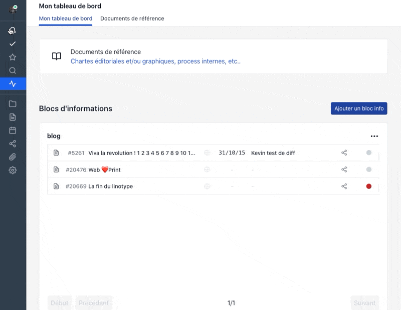

## Even faster interface

On a daily basis you change page hundreds of times to move from a content to a list and then to a project etc ...

Every millisecond counts.

In the last few weeks we have been working hard to improve these rendering times for each operation, saving 10 milliseconds here, 1 second there.

All in all, you now have a more reactive interface, which loads only the essential.

## Editing block

Now you can block the editing of a content and tell the team why you wanted to block it.

Useful in case of sensitive content that must be validated as is by your legal department.

## An image drag and drop directly in the editor automatically adds it to the linked files.

You can drag and drop an image directly in the editor and it will be automatically added to the linked files. No more need to upload it first and insert it later. Time saving.

## Sharing security

[https://app.pilot.pm/sharings/](https://app.pilot.pm/sharings/)

Managing the security of an account requires a global view of the content sharing that takes place from your account to the outside world.

This new interface, accessible to administrators only, allows you to have a complete view of all the shares made by team members.

This makes it possible to locate the oldest ones, for example, to close them. Or to close everything immediately in case of a problem (for those shared without a password).

Be careful, your shares remain secure and are made thanks to unique urls sent to your contacts.

