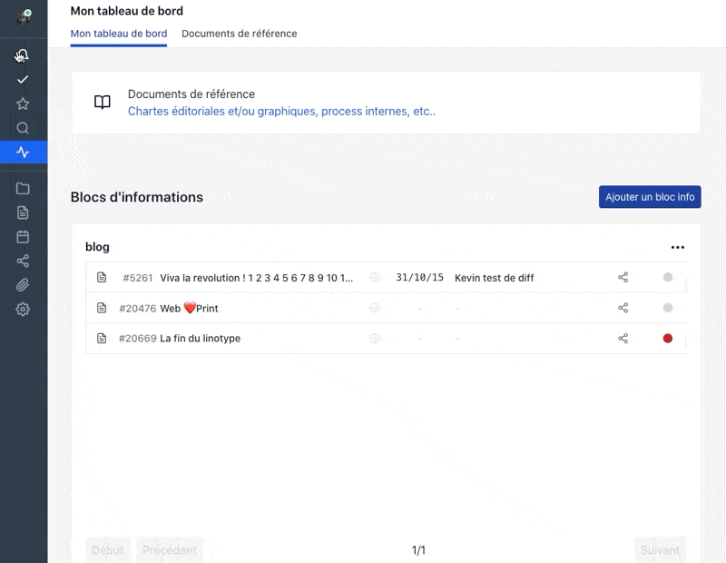
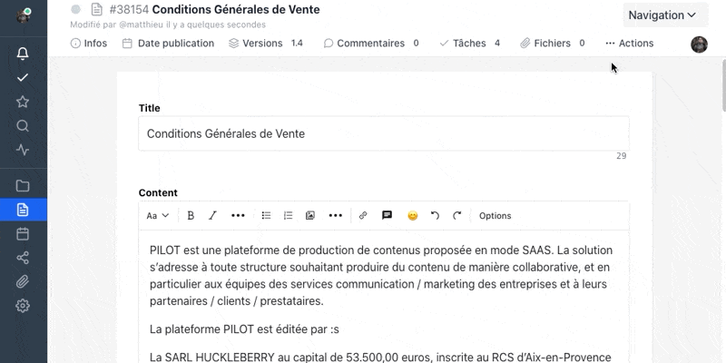
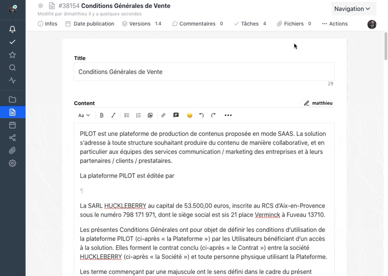
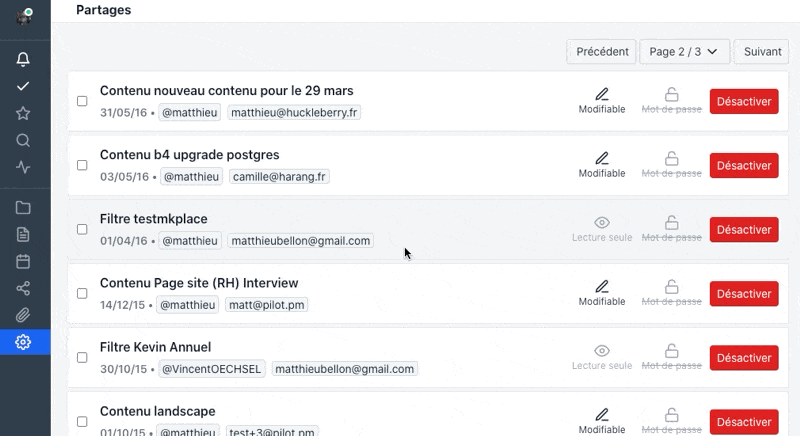

## Interface encore plus rapide

Au quotidien vous changez de page des centaines de fois pour circuler depuis un contenu vers une liste puis vers un projet etc .. **Chaque milliseconde compte.**

Ces dernières semaines nous avons mené un travail de fond pour améliorer ces temps de rendu pour chaque opération, gagner 10 millisecondes ici, 1 seconde là.

Au global vous disposez désormais d'une interface plus réactive, qui charge uniquement l'essentiel.

<figure class="full-width">

</figure>

## Blocage d'édition

Désormais vous pouvez bloquer l'édition d'un contenu et signaler à l'équipe pourquoi vous avez souhaité bloquer ce contenu.

Utile en cas de contenu sensible devant obligatoirement être validé en l'état par votre service juridique.

<figure class="full-width">

</figure>

## Un drag and drop d'image directement dans l'éditeur l'ajoute automatiquement aux fichiers liés.

Vous pouvez glisser-déplacer une image directement dans l'éditeur et elle sera automatiquement ajoutée aux fichiers liés. Plus de besoin de l'uploader d'abord et l'insérer ensuite. Gain de temps.

<figure class="full-width">

</figure>

## Sécurité des partages  

[https://app.pilot.pm/sharings/](https://app.pilot.pm/sharings/)

Gérer la sécurité d'un compte passe par une vue globale des partages de contenus qui sont effectués depuis votre compte vers l'extérieur. 

Cette nouvelle interface, accessible aux administrateurs uniquement, permet d'avoir une vue complète sur tous les partages effectués par les membres de l'équipe. 

Cela permet de repérer les plus vieux, par exemple, pour les fermer. Ou de tout fermer immédiatement en cas de souci (pour ceux partagés sans mot de passe).

Attention, vos partages restent sécurisés et sont effectués grâce à des urls uniques envoyées à vos contacts.

<figure class="full-width">

</figure>