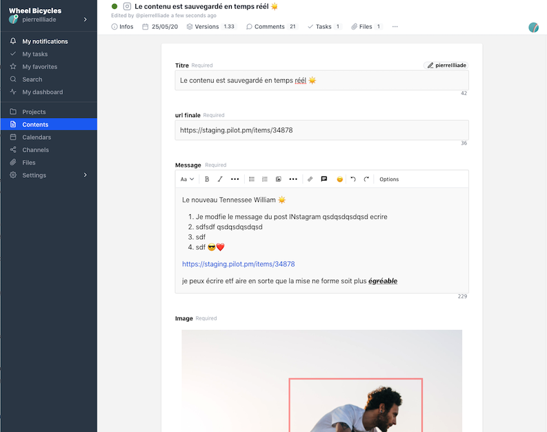
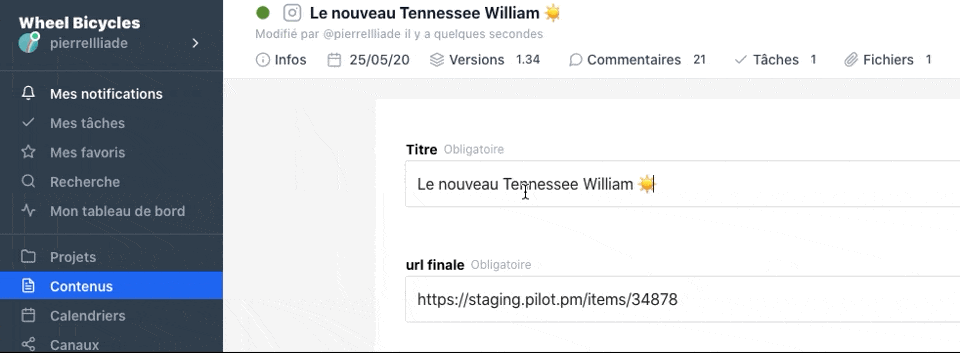

# New interface

A new interface, which adapts to the width of your screens, easier to understand and use on a daily basis.

# Real-time saving

From now on the backup of your contents is done in real time. No more need to save manually. You work, we take care of the rest.

The content editing forms are now also collaborative, you can connect with all your team members without any problem.

# You need help ?

Write to us support@pilot.pm or hit the blue button in the bottom right corner of your screen. We will guide you throught the new UI.

# Webinars

If you want to discover the new Pilot, please subscribe to our webinars. In 30 minutes we will show you the main features and you will be ready to start working with your team.

<iframe width="100%" height="400" frameborder="0" src="https://app.livestorm.co/p/b155b680-1f96-435f-b270-e4c89350a24e/form" title="Pilot : Tout comprendre pour rejoindre rapidement une équipe existante | Pilotpm"></iframe>