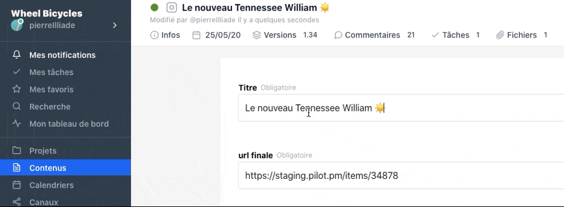

# Nouvelle interface

Une nouvelle interface, qui s'adapte à la largeur de vos écrans, plus simple à comprendre et à utiliser au quotidien.

## Un menu plus simple et qui regroupe tous vos outils

# Sauvegarde en temps réél

Désormais la sauvegarde de vos contenus se fait en temps réél. Plus besoin de sauvegarder manuellement. Vous travaillez, nous nous occupons du reste.

Les formulaires d'édition de contenus sont aussi désormais collaboratifs, vous pouvez vous y connecter à plusieurs sans problème.

# Vous avez besoin d'aide ?

Écrivez-nous à support@pilot.pm ou appuyez sur le bouton bleu en bas à droite de votre écran. Nous vous guiderons à travers la nouvelle interface.

# Webinars

Si vous voulez découvrir le nouveau Pilot inscrivez vous à nos webinars. En 30 minutes nous vous ferons découvrir les principales fonctionnalités et vous serez prêt à commencer à travailler avec votre équipe.

<iframe width="100%" height="460" frameborder="0" src="https://app.livestorm.co/p/b155b680-1f96-435f-b270-e4c89350a24e/form" title="Pilot : Tout comprendre pour rejoindre rapidement une équipe existante | Pilotpm"></iframe>