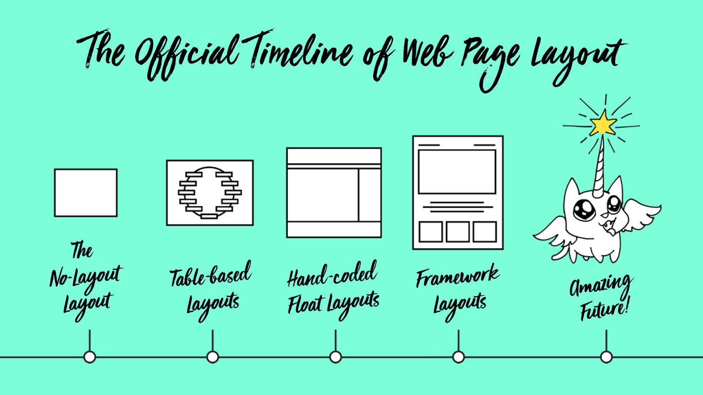

<iframe width="100%" height="430" class="my-10 mx-auto" src="https://www.youtube.com/embed/E005mjqpZ9Y" frameborder="0" allow="accelerometer; autoplay; encrypted-media; gyroscope; picture-in-picture" allowfullscreen></iframe>

Pour quelqu'un ayant toujours travaillé sur un ordinateur, à organiser des pavés de texte pour des écrans c'est toujours fascinant de découvrir, au travers de cette vidéo de [Jen Simmons](http://jensimmons.com/), l'histoire de la composition de pages d'imprimeries, des techniques, méthodes et outils alors utilisés. 

On voit rapidement l'héritage de l'imprimerie qui s'est diffusé dans notre code et comment l'histoire se poursuit pour le numérique, notamment avec le récent module CSS "Grid" qui semble enfin nous permettre d'atteindre le degré de souplesse dont bénéficiait l'imprimerie (40 ans après le premier ordinateur en gros).

## CSS “Grid”

Issus de son labo ([http://labs.jensimmons.com/2017/03-004.html](http://labs.jensimmons.com/2017/03-004.html)) quelques exemples montrent effectivement des possibilité avancées, que l’on peut même marier avec des techniques de *responsive design*

## “Paste-Up” et “Hot Metal”

Durant la vidéo la “technique web” est superficiellement abordée et Jen Simmons convoque rapidement l’Histoire de l’édition et des techniques de mise en page.

Elle aborde une technique qu’elle a elle même pratiquée, lors de ses débuts dans le design graphique : le “Paste Up” ou l’assemblage des éléments de la page, à la main.

La mise en page était très libre, simplement du “collage” en fait, et a permis une véritable libération de la créativité des designers graphiques après des siècles de composition “rigide” et dans des “boîtes” imposées par les techniques d’imprimerie “historiques”. 

Avant l’arrivée de la photographie et du “Paste up” la mise en page était fortement contrainte par les techniques d’imprimerie alors en usage : concevoir des blocs de texte à partir de plomb typographique fondu, agencer ces blocs dans des cadres en métal, serrer, verrouiller, et envoyer aux rotatives. C’était évidement extrêmement “rigide” et laissait très peu de possibilités pour une mise en page au delà de l’angle droit.

> (*Il faut absolument voir à ce sujet cet étonnant documentaire sur *[*la fin des machines Linotype au New York Times.*](http://Farewell - ETAOIN SHRDLU))

Cette révolution qu’a connu l’imprimerie, en passant des caractères en métal (“Hot metal”) au “Paste up” s’apparente, selon Jen Simmons, à ce que le web va connaître en passant d’une mise en page en “table layout” (pour parler vite) au fameux CSS grid : plus de liberté et plus de créativité.

On va y ajouter la fin du débat stérile print vs. web et surtout le fait de pouvoir se plonger dans les trésors de connaissances de l’imprimerie pour les porter à l’écran.

——————————————————-

> Jen Simmons est *developper advocate* chez Mozilla (éditeur du navigateur Firefox), c’est à dire que sa mission est de se tenir au courant de l’avancée des technos, de tester des trucs un peu à l’avant garde et de résumer le tout au Peuple du Web dont la tête reste bloquée dans le guidon du quotidien. Vous savez de quoi je parle.
>
> Son site : [http://jensimmons.com/](http://jensimmons.com/)
>
> Ses expériences : [http://labs.jensimmons.com/](http://labs.jensimmons.com/)

