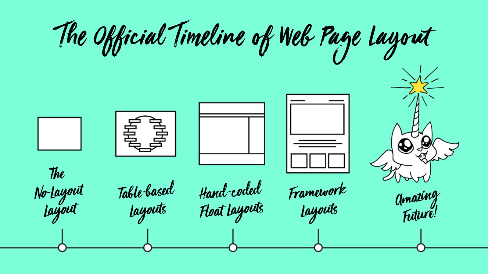

<iframe width="100%" height="430" class="my-10 mx-auto" src="https://www.youtube.com/embed/E005mjqpZ9Y" frameborder="0" allow="accelerometer; autoplay; encrypted-media; gyroscope; picture-in-picture" allowfullscreen></iframe>

For someone who has always worked on a computer, organizing textpads for screens, it is always fascinating to discover, through this video by [Jen Simmons](http://jensimmons.com/), the history of typesetting in printing, the techniques, methods and tools used at the time. 

We quickly see the legacy of the printing press that has spread throughout our code and how the story continues for the digital world, especially with the recent CSS "Grid" module that finally seems to allow us to reach the degree of flexibility that the printing press enjoyed.

## CSS "Grid"

From her lab ([http://labs.jensimmons.com/2017/03-004.html](http://labs.jensimmons.com/2017/03-004.html)) some examples actually show advanced possibilities, which can even be combined with *responsive* techniques.

## "Paste-Up" and "Hot Metal"

During the video the "web technique" is superficially approached and Jen Simmons quickly summons the History of publishing and layout techniques.

She approaches a technique that she practiced herself, at the time of her beginnings in graphic design: the "Paste Up" or the assembly of the elements of the page, by hand.

The layout was very free, simply "collage" in fact, and allowed a true release of graphic designers' creativity after centuries of "rigid" composition and in "boxes" imposed by "historical" printing techniques. 

Before the advent of photography and "Paste up" the layout was heavily constrained by the printing techniques then in use: designing text blocks from molten typographic lead, arranging these blocks in metal frames, clamping, locking, and sending to the presses. This was obviously extremely "rigid" and left very few possibilities for a layout beyond the right angle.

This revolution that printing has undergone, by passing from metal characters ("Hot metal") to "Paste up" is similar, according to Jen Simmons, to what the web will experience by passing from a layout in "table layout" (to speak quickly) to the famous CSS grid: more freedom and more creativity.

We will add the end of the sterile print vs. web debate and especially the fact of being able to dive into the treasures of printing knowledge to bring them to the screen.

——————————————————-

> Jen Simmons is *developper advocate* at Mozilla (editor of the Firefox browser), which means that her mission is to keep ahead of the progress of the techno, and summarize the whole to the People of the Web whose head remains buried in the everyday flow of things. You know what I'm talking about.
>
> Her website : [http://jensimmons.com/](http://jensimmons.com/)
>
> Her lab : [http://labs.jensimmons.com/](http://labs.jensimmons.com/)

Photo : <a style="background-color:black;color:white;text-decoration:none;padding:4px 6px;font-family:-apple-system, BlinkMacSystemFont, &quot;San Francisco&quot;, &quot;Helvetica Neue&quot;, Helvetica, Ubuntu, Roboto, Noto, &quot;Segoe UI&quot;, Arial, sans-serif;font-size:12px;font-weight:bold;line-height:1.2;display:inline-block;border-radius:3px" href="https://unsplash.com/@henkmul?utm_medium=referral&amp;utm_campaign=photographer-credit&amp;utm_content=creditBadge" target="_blank" rel="noopener noreferrer" title="Download free do whatever you want high-resolution photos from Henk Mul"><svg xmlns="http://www.w3.org/2000/svg" style="height:12px;width:auto;position:relative;vertical-align:middle;top:-1px;fill:white" viewBox="0 0 32 32"><title>unsplash-logo</title><path d="M20.8 18.1c0 2.7-2.2 4.8-4.8 4.8s-4.8-2.1-4.8-4.8c0-2.7 2.2-4.8 4.8-4.8 2.7.1 4.8 2.2 4.8 4.8zm11.2-7.4v14.9c0 2.3-1.9 4.3-4.3 4.3h-23.4c-2.4 0-4.3-1.9-4.3-4.3v-15c0-2.3 1.9-4.3 4.3-4.3h3.7l.8-2.3c.4-1.1 1.7-2 2.9-2h8.6c1.2 0 2.5.9 2.9 2l.8 2.4h3.7c2.4 0 4.3 1.9 4.3 4.3zm-8.6 7.5c0-4.1-3.3-7.5-7.5-7.5-4.1 0-7.5 3.4-7.5 7.5s3.3 7.5 7.5 7.5c4.2-.1 7.5-3.4 7.5-7.5z"></path></svg>Henk Mul</a>