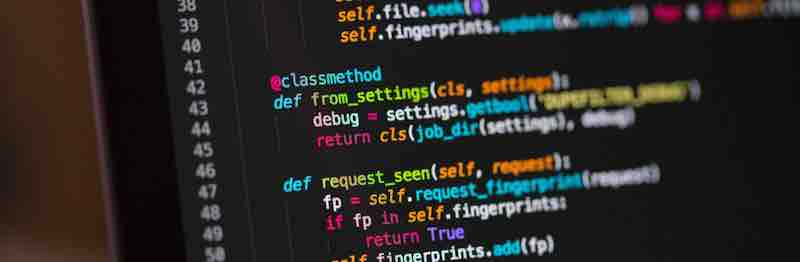

Au coeur du développement (logiciel, web, mobile,..) il y a un texte. Le [code source](https://fr.wikipedia.org/wiki/Code_source). Quelle que soit la technologie utilisée, le langage employé, tout peut se réduire à une chose : des lignes de texte qui indiquent à une machine ce qu’elle doit faire.

Ce texte “raconte” le comportement de la machine en fonction des interactions qu’elle va avoir soit avec des êtres humains soit avec d’autres machines. Tout comme une marque “raconte”  ce qu’elle est en interaction avec les différents publics qu’elle adresse.

Et aussi étonnant que cela puisse paraître le code source d’une application, comme la communication, porte du sens et des valeurs : vais-je respecter ou exploiter la vie privée de mes utilisateurs ? Vais je m’adapter ou non aux situations de handicap ? Serai-je accessible aux personnes ne bénéficiant pas de débits élevés ? 

Un code n’est pas “froid”, ce n’est pas un ensemble de pièces mécaniques emboitées les unes avec les autres, c’est un texte écrit par des êtres humains, qui peut souffrir de biais culturels, bénéficier de personnalités atypiques, être juste ou injuste comme toute production éditoriale.

Des lignes de code bien écrites seront efficaces, la machine ne se trompera jamais en les lisant, les objectifs seront atteints. Mal écrites elles ralentiront la machine qui comprendra mal ce qui doit être fait voire la feront échouer et les objectifs s’éloigneront. Un peu comme une newsletter de 10 pages que personne ne lira.

Produire les contenus d’une marque relève du même challenge. L’ensemble des textes que la marque “émettra” vers le public doivent fonctionner comme des lignes de code. Soit pour convaincre, soit pour vendre, soit pour attirer des talents.

Un texte mal écrit, mal pensé, aura plus ou moins d’efficacité pour atteindre l’objectif voire va faire “planter” la machine. On parlera alors de “crise”, le “bug” des producteurs de contenus.

Sur le fond code source et contenu éditorial sont identiques : du texte, écrit par des êtres humains (donc faillible), à l’attention d’un public.

## Les mêmes outils ?

Ecrire ce code est très complexe, non pas à cause du langage informatique en lui-même (la maîtrise de la grammaire et de l’orthographe est courante), mais parce qu’il faut très souvent le faire à plusieurs mains. 

Le code source d’une application est “éclaté” en centaines (ou milliers ou plus encore) de documents écrits, validés, corrigés à plusieurs mains.  Il faut trouver une organisation, des flux de travail et de validation pertinents pour ne pas perdre le fil de ce qui a été fait, de ce qui devra être fait.

Face à cette complexité grandissante il n’y eut pas d’autre choix que de se munir d’outils dédiés, de méthodes communes. Un des outils considéré comme un “pilier” indispensable pour cette production est  [le système de gestion de version](https://fr.wikipedia.org/wiki/Logiciel_de_gestion_de_versions). Sa mission ? : *“stocker un ensemble de fichiers en conservant la chronologie de toutes les modifications qui ont été effectuées dessus”*. Il est devenu littéralement vital dans la production de code.

Aujourd’hui personne ne peut développer une application avec des documents Word que l’on s’échangerait par email et sans un système de gestion de version. C’est impensable.

Pourtant, si on maintient le parallèle entre production de code et production de contenus on se rend compte que c’est bien ce qui se pratique aujourd’hui dans la production éditoriale : des centaines de documents Word circulant entre les boites mails des agences, des directions qui valident, des freelances qui traduisent, des SR qui corrigent. On tente de centraliser sur des serveurs partagés par forcément accessibles à tous. Bref, on bricole, souvent.

Une des conséquences est  l’opacité de la production pour celle ou celui qui pilote l’ensemble de l’équipe et qui doit donc avoir en permanence un état des lieux mental de ce qui est fait. Et qui devient donc un maillon “critique” de la chaîne. Pas le moment de tomber malade.

Alors non, pour des métiers aussi proches sur le fond il est évident que les producteurs de contenus ne bénéficient pas des mêmes outils, de la même sérénité, que les développeurs.

## Stratégie et conception : souvent le parent pauvre de la production, pour les deux métiers.

Une production de contenus, comme le développement d’une application, se pense en amont avec une étape plus ou moins importante de conception. On parle de stratégie de contenu ou de conception mais cela revient au même : à qui est ce que je m’adresse ? comment ? Dans quel but ?

Pendant que les communicants choisiront le ton a employer les développeurs pèseront le pour et le contre entre telle ou telle technologie en fonction des objectifs. Chacun devra choisir ses “outils” et définir la voie la plus efficiente pour parvenir à l’objectif.

De part et d’autre on va déterminer, entre autres, les persona comme le feront des UX designer car on ne conçoit pas une interface identique pour tous les publics, comme on n’écrit pas de la même façon pour toutes ses cibles.

Si ces étapes sont très proches pour les deux métiers force est de constater que, souvent, on ne leur alloue pas le temps nécessaire dans des projets éditoriaux ou web (mais c’est une analyse toute personnelle)

## Une application, tout simplement, se “lit” avant d’être “utilisée”.

Le monde de la production de contenus rejoint totalement le développement logiciel sur le terrain de l’interface : un mot mal choisi, une phrase mal tournée et c’est une fonctionnalité que l’on ne comprend pas, que l’on n’utilise pas et qui peut générer des erreurs au regard de l’utilisateur.

Avec l’expérience les producteurs d’applications se rendent compte (nous les premiers) que leur travail sera, in fine, lu comme on lit une affiche, un livre ou un article. Il faut être vigilant à la typographie, la mise en page, le ton, le rythme pour “parler” correctement à son public, dire ce que l’application va faire, peut faire.

## Des similarités, et alors ?

Nous sommes convaincus que de nombreux ponts sont possibles entre les métiers qui peuvent s’enrichir mutuellement. On peut faire circuler les outils, les méthodes, compétences éditoriales et capacités à penser le texte pour être lu (un bouton, un message d’erreur). 

Les “content strategist” travaillent souvent étroitement avec les équipes de développement non pas pour uniquement écrire le contenu mais aussi le “contenant”. 

C’est un premier “pont” entre les métiers, on pourra en imaginer beaucoup d’autres.
