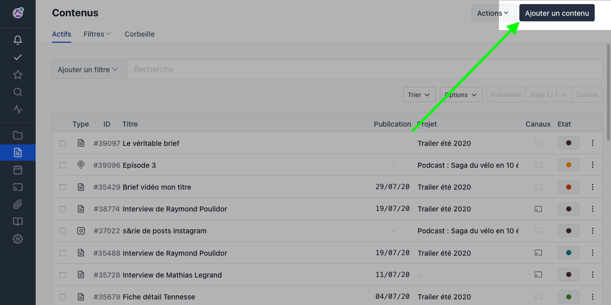
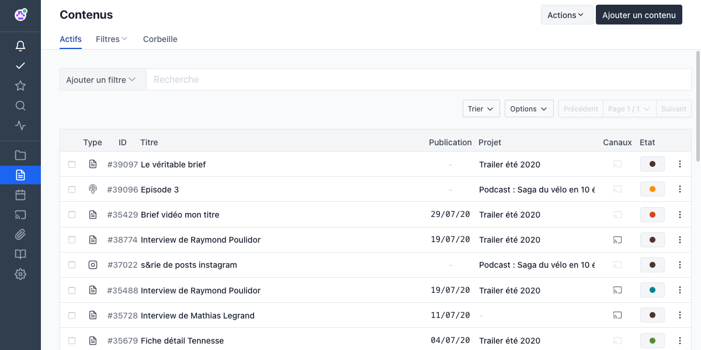

## Presentation

Pilot allows you to create different types of content. For example, it allows you to create different types of content:

-   An article
-   A tweet (and even a Twitter thread)
-   An Instagram publication, Facebook, Linkedin...
-   A video
-   A podcast
-   An email...

The created contents can be assigned to a project. You will also be able to distribute them via the channels of your choice.

## How to create a content?

{{}}

To create new content, go to the "**Contents**" section of the left menu. Then click on "**Add content "**. You will then be able to select the type of content you wish to create.

Depending on your needs, it is possible to configure the list of available content types.

## Overview of a piece of content

Here, the content we have chosen to create is an article. This is what it looks like in the application :

{{}}

## Content-specific tools

On the top are 6 categories:

{{}}

### Information or metadata

This menu displays general information about the content:

-   The project to which the content is assigned

-   The channel where the content will be published

-   Those responsible for the content

-   Linked content (in the case of translation, for example, to have a reference to the "master", or to link a brief to the written content)

### Publication date

Displays a calendar that allows you to select the date on which the content will be published.

### Versions

Pilot automatically saves changes to content. A new version of the content is created every 15 minutes if you make additional changes. You will then be able to navigate between version V1.1, V1.2 etc...

### Comments

You will be able to discuss the evolution of the document thanks to this functionality, which also offers a simple system for mentioning and alerting team members.

The person mentioned will receive an alert in their notifications.

### Tasks

Tasks can be assigned to each content. Each of these tasks will have a due date and one or more persons in charge.

### Linked files

You can link one or more files to your content, with no limit on document size. It can be a brief for example. To link a file, you can select it from your computer, or from the media library.

### Sharing

By clicking on the suspension points to the right of "Files", additional options appear:

Sharing with external validation is useful for querying people who do not have an account on Pilot. It is possible to allow your contact person to modify the document sent.
