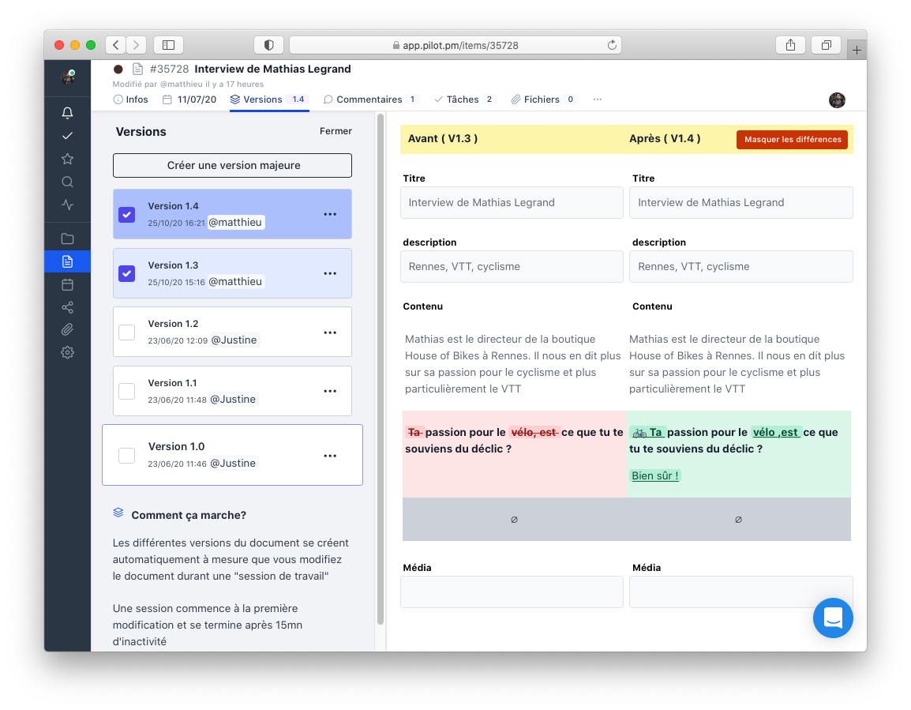

## Plus besoin de chercher la dernière version, elle est là
Versions mineures, versions majeures, toutes sont stockées depuis la première modification jusqu'à la plus récente. Parcourez l'historique complet d'un document, analysez les changements.

## Construisez vos modèles de contenus
Encadrez la production de vos contributeurs avec des formulaires spécialement adaptés à vos contraintes (cms, application mobile) : limites de caractères, email, champs répétables .. Vous pouvez même créer des formulaires avec PDF versionnables et annotables (pratique pour les validation de magazines)

## Zéro conflit de versions

Collaborez à plusieurs, en même temps, sur un même document. Plus de problème de conflits de versions, on ne se marche plus sur les pieds.

<figure class="full-width">

<figcaption>Toutes les versions sont conservées. </figcaption>
</figure>

## Les mentions ont plus de valeur que les emails !

Mentionnez les membres de votre équipes sur une partie d'un texte ou même un PDF. De cette manière les tâches à accomplir ne sont plus perdues dans des centaines d'emails.

## Qualifiez vos documents en un clin d'oeil

Ce document est il valide selon la structure décidée ? Repérez les problèmes le plus t^tot possible pour ne pas perdre de temps et évitez de devoir reprendre tout une site ou une maquette à la dernière minute parce qu'il manque des informations ou vous rendre compte trop tard qu'elles ne correspondent pas aux gabarits

