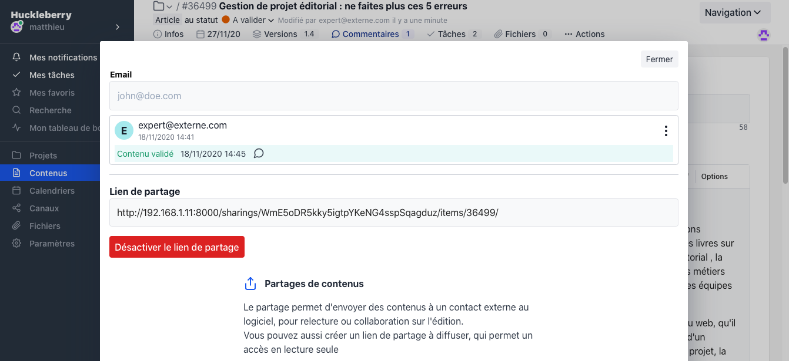

---
author: Mathieu
date: 2020-06-20
draft: false
menu: docs
description: La validation des contenus
slug: validation
title: La validation externe
weight: 4
---

<figure class="full-width">

</figure>

Pilot permet à ses utilisateurs de communiquer des documents à valider vers des contacts ne disposant pas de compte sur la plateforme.

Très utile pour faire valider un texte auprès d'un expert ou recevoir une approbation par la direction.

Les contacts externes peuvent modifier en temps réél le document et les modifications apportées seront tracées par le système de gestion de versions interne (ce qui permettra de savoir quelles modifications ont été apportées par les relecteurs)

La modification en temps réél du document permet d'éviter une gestion souvent chaotique de multiples versions à fusionner.

Plusieurs valideurs peuvent accéder simultanément au document et le modifier.

Vous pouvez égaement créer un lien externe de partage (lecture seule obligatoirement) qui permettra de diffuser largement le document à des personnes extérieures à la plateforme.

## Comment ça marche pour le contact externe ?

Un lien unique sera envoyé par email à votre contact qui pourra accéder au contenu (en lecture seule ou lecture /écriture selon votre choix)

Le contact externe pourra modifier directement le document à sa convenance, laisser des annotations ou ne rien faire et simplement cliquer sur "Valider" ou "Ne pas valider" le contenu (avec un commentaire optionnel)

L'utilisateur de Pilot ayant initié la demande de validation sera notifié dès la validation effectuée.

<figure class="full-width">

</figure>

