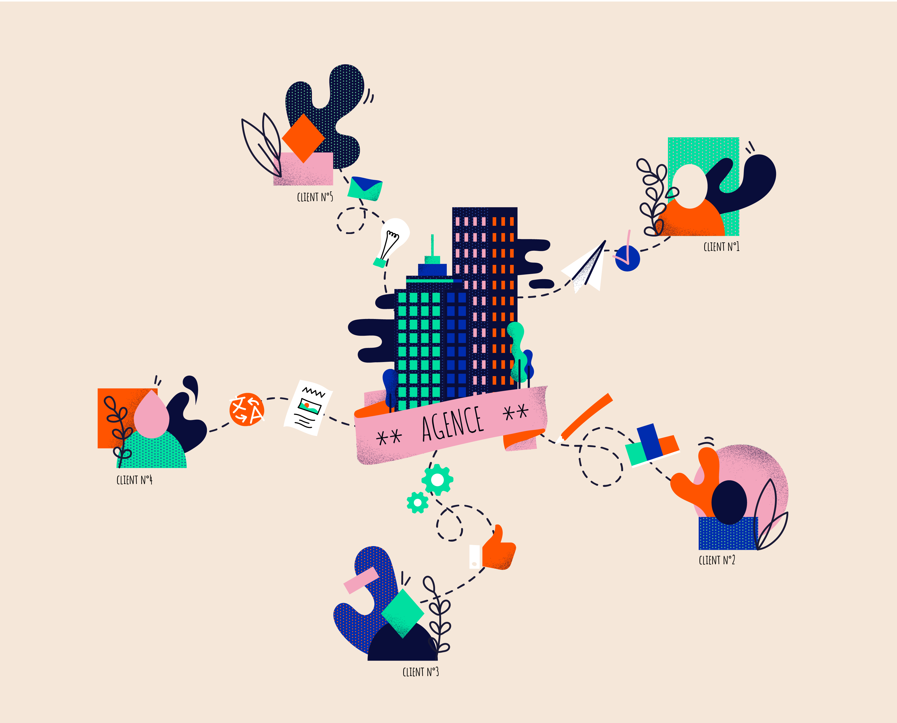

# Vous êtes une agence ? Engager vos clients n’a jamais été aussi simple

Aujourd’hui, chacun de vos clients fonctionne d'une manière différente lorsqu'il s'agit de la gestion de leurs contenus. 

Et si vous pouviez arrêter de courir après les échanges d’e-mails, de fichiers Word ? 

### Voici comment Pilot va vous faciliter la vie :

1 Desk = 1 client = un espace de travail partagé entre votre équipe et celle de votre client

* Centralisez vos projets clients : plus de temps perdu à échanger par mail pour chaque demande de modification 

* Simplifiez votre communication : votre équipe et vos clients bénéficient d’une vision d’ensemble des contenus 

* Engagez vos clients : commenter, modifier et valider directement sur Pilot

### Une formule flexible, adaptée à votre quotidien

Avec l’offre agence :

- Le premier mois est offert sur chaque nouveau Desk

- 10 users par Desk (les membres de votre équipe ne sont pas inclus)

- Vous n’êtes facturés que pour les Desks actifs 

- Projets illimités sur chaque Desk 

- Contenus illimités sur chaque Desk 

- 30 GO de stockage par Desk 
